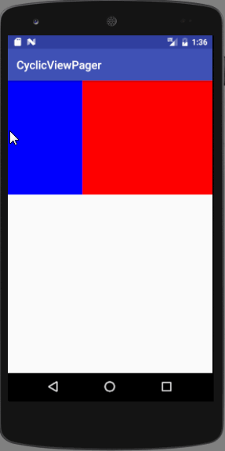

## 可循环滑动的ViewPager

实现原理：

在原始数据的基础上增加一个头和尾，例如原始数据为[a1,b1,c1]三条数据，然后在头尾各增加一条数据变成[c2,a1,b1,c1,a2],c2与c1，a2与a1的内容是一样的，再通过OnPageChangeListener监听viewpager是否滑到了头或滑到了尾，如到了头或尾就重新设置一下ViewPager的当前显示页，比如像上面的数据，当显示c2页的时候，就人为切换到c1，当显示a2的时候就人为切换到a1，这样无论往前往后滑都做到了真正的循环。

效果图：

